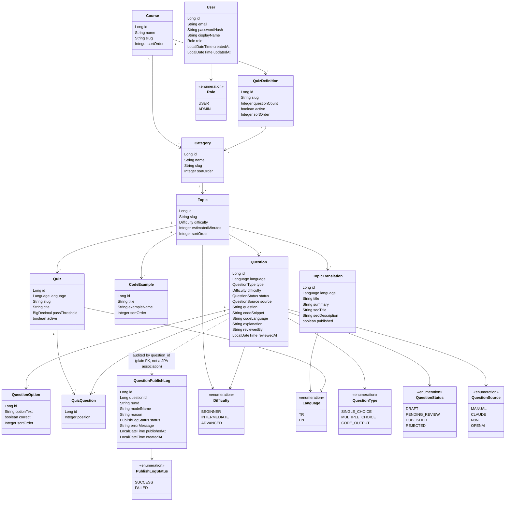

# LearnForgeX

A bilingual (Turkish/English) learning platform covering Java, Spring Boot, React,
AI/LLMs, PostgreSQL, Git & GitHub, and Docker. Live at
[learnforgex.com](https://learnforgex.com).

Source: [github.com/cdurgun/learning-platform](https://github.com/cdurgun/learning-platform)

```bash
git clone https://github.com/cdurgun/learning-platform.git
```

## Overview

- **7 courses**, each split into categories and topics: Java, Spring Boot, React, AI,
  PostgreSQL, Git & GitHub, and Docker.
- Every topic is a long-form, self-contained lesson with embedded, real, compilable code
  examples (Java, TypeScript/React, shell/SQL snippets depending on the course).
- A **question-pool quiz system**: a per-topic fixed quiz, a cross-topic "Practice" mode,
  and a category-scoped "Quiz Area" all draw from the same pool of reviewed questions.
- Optional, session-based **user authentication**, with an admin-only question review/
  publish workflow.
- Fully bilingual at the URL level (`/en/...`, `/tr/...`), with independent per-language
  publish status, SEO metadata, hreflang, and a generated sitemap.

## Architecture

- **Database (PostgreSQL) holds metadata only** — the course/category/topic hierarchy,
  per-language translation rows (title, summary, SEO fields, publish flag), the question
  pool, and quiz definitions. It never stores lesson prose.
- **Markdown files** (`src/main/resources/content/{lang}/{slug}.md`) are the single
  source of truth for a lesson's actual content.
- **Real, compilable code examples** (`src/main/resources/examples/{topic-slug}/*.ext`)
  are embedded into a lesson by writing `{{FileName.ext}}` in its Markdown — the
  extension drives both the fenced-code-block language tag and the file lookup, so the
  same mechanism embeds Java, TypeScript/JSX, or shell snippets identically.
- **Database ↔ file linkage is by slug convention only** — no file path is ever stored
  in the database: `content/{language}/{topic.slug}.md` and
  `examples/{topic.slug}/{example_name}.{ext}`.
- **Publish status lives at the translation level, not the topic level** — a `Topic` has
  no `published` flag; `TopicTranslation` does. A topic can be live in Turkish while its
  English translation is still a draft (or vice versa). Requesting a topic in a language
  it isn't published in yet shows a friendly "not available in this language" page (with
  a link to the language it *is* available in), never a 404.

## Content Rendering Pipeline (Markdown → HTML)

`MarkdownService` turns a topic's raw Markdown into page HTML in three steps:

1. **Preprocess** — replaces every `{{ExampleName.ext}}` placeholder with the matching
   file's contents from `examples/{topic-slug}/`, wrapped in a fenced code block tagged
   with that extension's language.
2. **Parse + render** — CommonMark renders standard HTML (core CommonMark plus the
   heading-anchor extension only; no GFM tables extension, so lesson content never uses
   Markdown tables).
3. **Callout post-process** — single-paragraph `> 💡 Tip ...` / `> ⚠️ Warning ...`
   blockquotes are rewritten into Bootstrap alert boxes.

## Internationalization

Language is part of the URL path, not a query parameter: real content lives under
`/en/topics/{slug}` and `/tr/topics/{slug}` (homepage: `/en`, `/tr`). The bare `/` acts
as a negotiator defaulting to English; legacy `/topics/{slug}?lang=..` URLs are
permanently redirected to the new path-based address.

- **Content translation**: `TopicTranslation` (title/summary/SEO) plus
  `content/{lang}/{slug}.md` (the lesson body itself).
- **UI chrome**: `messages.properties` / `messages_tr.properties` /
  `messages_en.properties` with Thymeleaf's `#{...}` syntax, resolved directly from the
  URL's language segment (`LangParamLocaleResolver`, `LangPath`) — no cookie, no
  session, fully stateless.
- **SEO**: every absolute URL (hreflang, canonical, Open Graph/Twitter, JSON-LD,
  `sitemap.xml`) is built from a single `app.base-url` property, never a hardcoded
  domain, and hreflang is only emitted for languages that are actually published.

## Question Pool & Quiz System

Quiz questions live in a general-purpose pool (`Question` / `QuestionOption`), decoupled
from any specific quiz:

- **`type`**: `SINGLE_CHOICE`, `MULTIPLE_CHOICE`, `CODE_OUTPUT`
- **`difficulty`**: `BEGINNER`, `INTERMEDIATE`, `ADVANCED`
- **`status`**: `DRAFT`, `PENDING_REVIEW`, `PUBLISHED`, `REJECTED`
- **`source`**: `MANUAL`, `CLAUDE`, `N8N`, `OPENAI`

Three independent consumers draw from the same pool of `PUBLISHED` questions:

- **Fixed quiz** — a curated, per-topic quiz (`Quiz` + `QuizQuestion` join, with an
  explicit question order) rendered at the bottom of a topic page.
- **Practice** — random, filterable (topic/language/difficulty/type) practice sessions
  across the whole pool.
- **Quiz Area** — a course-wide catalog of reusable, category-scoped quiz definitions
  (`QuizDefinition`, `@ManyToMany` to `Category`) that draw a random set of questions
  each time they're played.

New questions can be added by hand or ingested through an internal, API-key-protected
endpoint (`POST /api/internal/questions/ingest`), always landing as `PENDING_REVIEW`.
An `ADMIN`-only review screen (`/{lang}/admin/questions`) lists pending questions for
publish/reject; every automated publish attempt is additionally recorded in
`QuestionPublishLog`, an audit trail independent of the JPA entity graph (it holds a
plain `question_id` rather than a mapped association, precisely so it survives even if
the underlying question is later deleted).

## Authentication

Session-based form login (Spring Security), BCrypt-hashed passwords, no JWT/OAuth2 —
deliberately simple for a server-rendered Thymeleaf application. The public learning
experience (browsing, practicing, taking the fixed quiz) is entirely open to anonymous
users; only `/{lang}/admin/**` requires the `ADMIN` role.

## Requirements

- Java 21+
- Maven 3.9+
- Docker (for a local PostgreSQL instance)

## Local Development

```bash
docker compose up -d
./mvnw spring-boot:run -Dspring-boot.run.profiles=dev
```

The app comes up at http://localhost:8080. Flyway creates/updates the schema and seed
content automatically on startup.

> **Note:** `docker-compose.yml` publishes PostgreSQL on host port **5433** (the
> container's own internal port is still 5432). This avoids colliding with a native
> PostgreSQL that many development machines already have listening on 5432.
> `application-dev.yml` / `application-test.yml` point at 5433 accordingly.

## Profiles

| Profile | Purpose |
|---|---|
| `dev`  | Local development, Docker Compose PostgreSQL (host port 5433) |
| `test` | Test runs (separate `learning_test` database) |
| `prod` | Production, configured entirely through environment variables |

## Database Migrations (Flyway)

Migrations live under `src/main/resources/db/migration/{topic-or-course-slug}/`,
recursively scanned by Flyway (subfolder depth is purely organizational and doesn't
affect version ordering). Version numbers are strictly sequential and never rewritten
retroactively. A new topic typically follows: `V{n}__{slug}_topic.sql` (skeleton) →
one or more `V{n+k}__{slug}_sections*.sql` (content/example metadata) →
`V{n+m}__publish_{slug}_english.sql` (flips the English translation live once ready).
Quiz questions for a topic follow their own three- or four-file pattern (question
promotion → quiz shell if one doesn't already exist → EN link → TR link), always
idempotent (`NOT EXISTS` / `ON CONFLICT DO NOTHING`) so a migration can be safely
re-run. The full, detailed history of every migration and the reasoning behind each
architectural decision lives in [`docs/phase-log.md`](docs/phase-log.md) and
[`docs/known-constraints.md`](docs/known-constraints.md).

## Project Structure

```
src/main/java/com/cdurgun/learning/
    domain/            Course, Category, Topic, TopicTranslation, CodeExample,
                       Question, QuestionOption, Quiz, QuizQuestion, QuizDefinition,
                       QuestionPublishLog, User, plus enums (Difficulty, Language,
                       QuestionType, QuestionStatus, QuestionSource, PublishLogStatus, Role)
    domain/converter/  Language <-> DB code converter (tr/en)
    repository/        Spring Data JPA repositories
    service/           ContentResolver, CodeExampleResolver, MarkdownService,
                       NavigationService, QuizService, PracticeService, QuestionScorer,
                       QuestionIngestService, QuestionReviewService, QuestionPublishAuditService,
                       QuizDefinitionService, QuizNavigationService, PdfExportService,
                       CustomUserDetailsService, UserRegistrationService
    controller/        HomeController, TopicController, AuthController, PracticeController,
                       QuizAreaController, QuestionIngestController, QuestionReviewController,
                       QuestionAutoPublishController, GenerationToolingController,
                       SitemapController
    config/            LangParamLocaleResolver, LangPath, WebConfig, SecurityConfig,
                       QuizIngestApiKeyInterceptor
    web/               DTOs, grouped by feature: nav/, quiz/, ingest/, review/, publish/,
                       internal/, auth/ (plus a sitewide GlobalModelAttributes)

src/main/resources/
    content/{tr,en}/{slug}.md     Lesson content (single source of truth)
    examples/{slug}/*.{ext}       Real, compilable/runnable code examples
    db/migration/                 Flyway migrations, organized per topic/course
    templates/                    Thymeleaf templates (Bootstrap + highlight.js)
    messages*.properties          UI text translations
```

## Domain Model



## Courses & Content

| Course | Categories | Topics |
|---|---|---|
| Java | 8 | 45 |
| Spring Boot | 5 | 39 |
| React | 11 | 32 |
| AI | 5 | 18 |
| PostgreSQL | 2 | 14 |
| Git & GitHub | 2 | 11 |
| Docker | 2 | 9 |

Every topic follows a consistent shape: a conceptual introduction, several sections
each building on the last (usually anchored to a real, embedded code example), a best
practices / common mistakes section, and a closing summary, cheat sheet, and glossary.
Several categories (React, Docker) additionally close with a hands-on practical
project.

## Further Documentation

- [`docs/phase-log.md`](docs/phase-log.md) — the complete, chronological history of how
  this project was built, decision by decision.
- [`docs/known-constraints.md`](docs/known-constraints.md) — the full history of every
  known environment/tooling constraint and how it was discovered.
- [`docs/ProjectPlan.md`](docs/ProjectPlan.md) — the original content roadmap this
  project was planned against.
